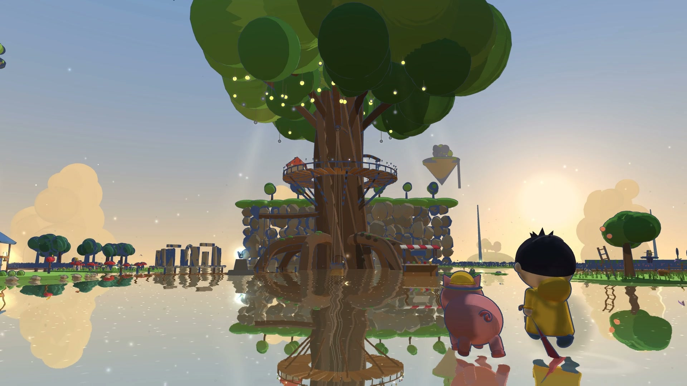
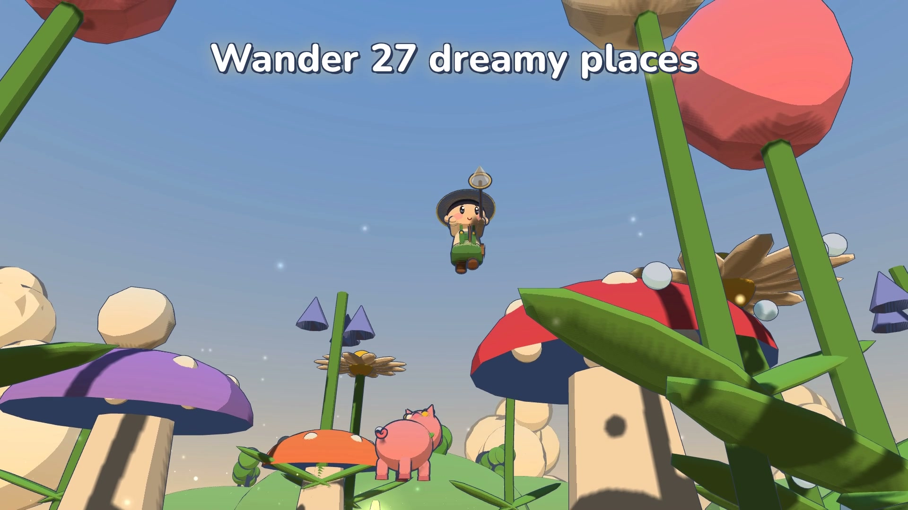
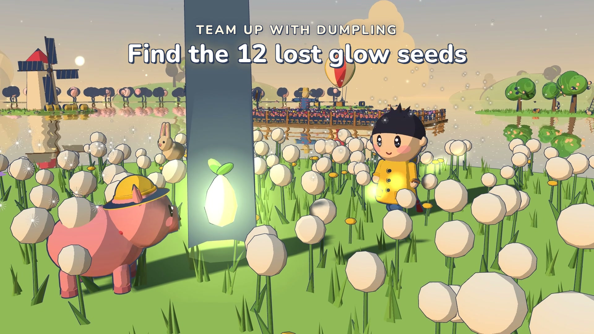
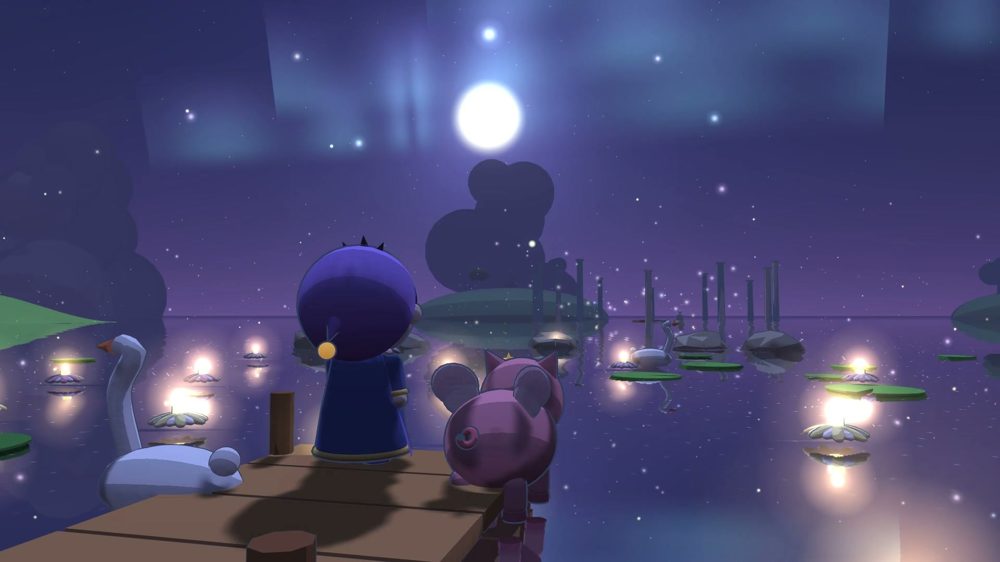

# Great Tree Meadow

巨树花海 · 大樹と花の海

Explore a meadow on a mirror lake with Dumpling, a small pink piglet. Find twelve glow seeds and make the great tree bloom again.

**Play: [GitHub Pages](https://zhechen-cs.github.io/great-tree-meadow/) · [itch.io](https://zhecc.itch.io/great-tree-meadow)**

[Download for offline play](https://github.com/zhechen-cs/great-tree-meadow/releases/latest) · [Watch the gameplay trailer (32 s)](https://github.com/zhechen-cs/great-tree-meadow/releases/download/v1.0.0/great-tree-meadow-trailer-en.mp4)

A self-contained HTML game with **no runtime network requests**: Three.js rendering, procedural music and sound effects through Web Audio, and keyboard/mouse or mobile touch controls. The release pipeline tests the built HTML and package before promoting those exact artifacts.

<table>
  <tr>
    <td width="50%"></td>
    <td width="50%"></td>
  </tr>
  <tr>
    <td width="50%"></td>
    <td width="50%"></td>
  </tr>
</table>

Frames from the real gameplay trailer.

## In the meadow

- 27 areas: flower fields, a sunflower maze, a waterfall cave, floating islands and more.
- Dumpling follows, sniffs out seeds, plays fetch, naps and poses for photos.
- Furnish and extend your home with 47 furniture types; cook, fish, catch bugs, garden and collect discoveries.
- Day/night scenery, English/Chinese/Japanese, and comfort options for motion, flashes, camera and touch layout.

## Controls

| Action | Keyboard / mouse | Touch |
|---|---|---|
| Move / run | `WASD` or arrow keys, hold `Shift` | Left joystick, push to the edge |
| Jump | `Space` | Jump button |
| Interact, Dumpling's menu | `E` | Large button |
| Let Dumpling sniff for seeds | `Q` | Sniff button |
| Fish (facing water) | `F`, hold to reel | Fish button |
| Map · Home · Decorate | `M` · `G` · `B` | Top-right buttons |
| Field guide · Tasks · Outfits · Day/night | `J` · `T` · `C` · `N` | Top-right buttons |
| Settings / pause | `Esc` | Gear button |
| Camera | Drag, scroll to zoom, click the water to walk there | Drag, pinch |

## Build and test

Node.js 24 LTS:

```sh
npm ci --ignore-scripts
npx playwright install chromium firefox webkit
npm run build:dev
npm run release
npm test
npm run test:smoke
```

`dist/index.html` runs directly from disk; `release/great-tree-meadow-<version>-web.zip` is ready for itch.io. `npm run serve` serves the build on port 8080.

The first build downloads five fonts from a pinned [google/fonts](https://github.com/google/fonts) commit and verifies their SHA-256 hashes. Subsequent builds work offline. `npm run release` checks translations, builds, audits and verifies the package; CI additionally runs the full Chromium regression suite and Firefox/WebKit release smoke tests. These engine tests do not replace testing every mobile device or browser version.

## Engineering

- Three.js r128: toon shading, inverted-hull outlines, planar lake reflections and bloom.
- Instanced grass and flowers, geometry merged by material, area-based distance culling and adaptive quality.
- Companion state machine with breadcrumb following and obstacle checks; a separate home scene with furniture placement and collision validation.
- Versioned, validated local saves with text export/import; all audio is synthesized locally.

See [architecture](docs/ARCHITECTURE.md) for the source layout and systems. CI retains a tested release bundle; Pages deploys it without rebuilding.

## License

© 2026 Zhe. Personal download and play of official releases are permitted; modification, redistribution and commercial reuse require written permission. See [LICENSE](LICENSE). Three.js and fonts retain their [third-party licenses](THIRD_PARTY_NOTICES.md).
