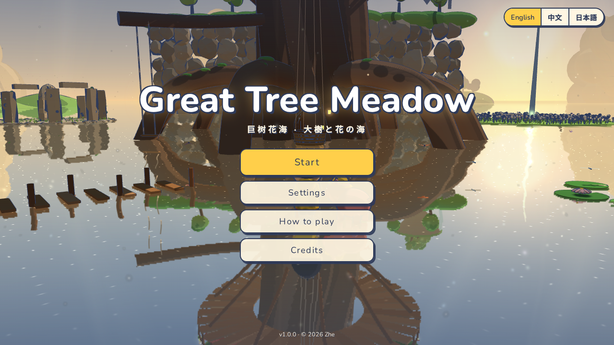
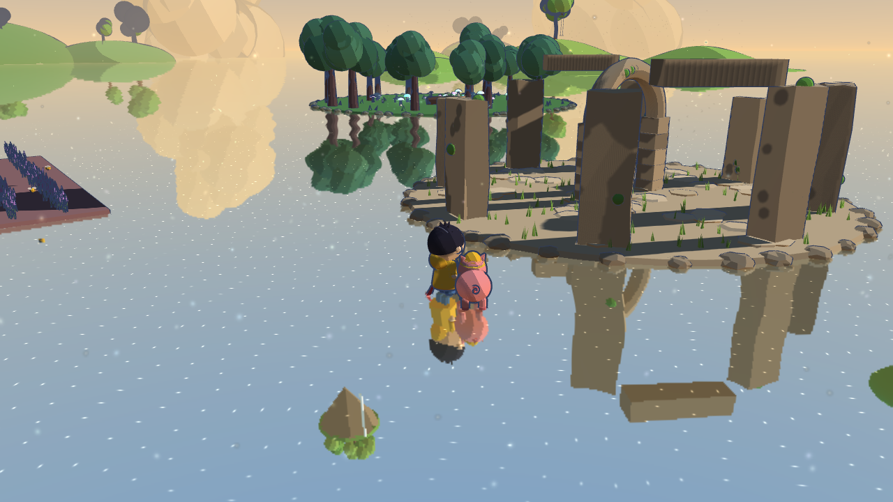
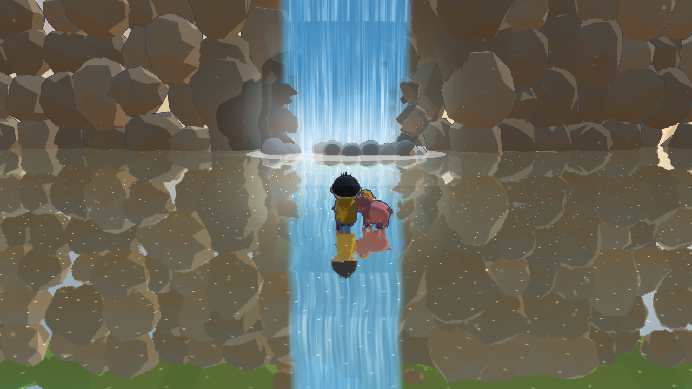
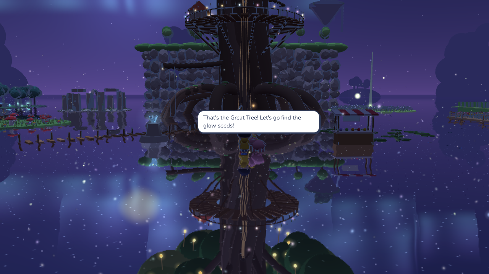
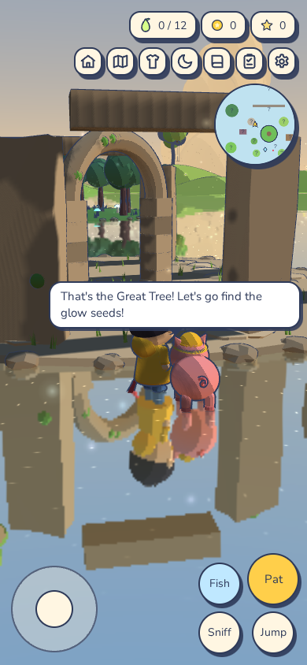

# Great Tree Meadow

*巨树花海 · 大樹と花の海*

A cozy 3D exploration game that runs in the browser. You and Dumpling, a small
pink piglet, wander a fairyland meadow built on a shallow mirror lake, looking
for the twelve glow seeds that once made the great tree in the middle bloom.

The browser release will be available here once GitHub Pages is deployed.



| | |
|---|---|
|  |  |
|  |  |

## Features

- Twenty-seven areas across a 300 m radius world: flower fields, a sunflower
  maze, a cave behind a waterfall, floating islands, a mirror lake and more.
- A companion that follows you, sniffs out seeds, plays fetch, naps and poses
  for photos.
- A home you can extend and furnish (47 kinds of furniture), cooking,
  fishing, bug catching, a vegetable patch, a shop, a field guide,
  achievements and daily tasks.
- Day and night, generative music and sound effects (no audio files).
- English, Chinese and Japanese, switchable at any time.
- Keyboard and mouse, or touch controls on phones and tablets.
- Comfort options: motion-comfort mode, reduced flashes, field of view,
  camera sensitivity and inversion, text size, left-handed touch layout.
- One self-contained HTML file (about 2.6 MB). It makes no network requests
  and also works offline by opening the file directly.

## Controls

| Action | Keyboard / mouse | Touch |
|---|---|---|
| Move / run | `WASD` or arrow keys, hold `Shift` | Left joystick, push to the edge |
| Jump | `Space` | Jump button |
| Interact, Dumpling's menu | `E` | Large button |
| Let Dumpling sniff for seeds | `Q` | Sniff button |
| Fish (facing water) | `F`, hold to reel | Fish button |
| Map · Home · Decorate | `M` · `G` · `B` | Top-right buttons |
| Field guide · Tasks · Outfits · Day/night | `J` · `T` · `C` · `N` | Top-right buttons |
| Settings / pause | `Esc` | Gear button |
| Camera | Drag, scroll to zoom, click the water to walk there | Drag, pinch |

## Building

Requirements: Node.js 18.17 or newer.

```bash
npm ci
npm run build          # dist/index.html, the release page
npm run serve          # optional: serve dist/ on port 8080
```

The first build downloads the five fonts (about 40 MB) from a pinned commit of
the [google/fonts](https://github.com/google/fonts) repository into `fonts/`
and checks their SHA-256 hashes. Later builds work offline.

Other scripts:

| Command | What it does |
|---|---|
| `npm run build:dev` | `build/dev.html` with the test hooks and system fonts, builds in under a second |
| `npm run i18n` | checks that every source string has an English and a Japanese translation |
| `npm test` | browser regression tests (needs `build:dev` and `build` first) |
| `npm run audit` | pre-release checks: no debug code, no local paths, no external requests |
| `npm run package` | `release/great-tree-meadow-<version>-web.zip`, ready to upload to itch.io |
| `npm run release` | i18n check, build, audit and package in one go |
| `npm run format` | formats the code with Prettier |

The tests use Playwright with Chromium's software renderer, so they need no
GPU. Install the browser once with `npx playwright install chromium`. A full
run takes a few minutes because every rendered frame is slow on the CPU.

## Project layout

```
src/
  index.html            page markup: HUD, dialogs, title screen
  styles.css
  js/                   game code, concatenated in a fixed order (see tools/build.mjs)
    core.js             renderer, sky, mirror water, bloom, shared helpers
    i18n.js             language system
    characters.js       the boy and the piglet, outfits, animation
    world-*.js          world registry, collisions and every area of the map
    game.js             audio, save data, input, player, companion AI, camera, HUD
    companion.js        Dumpling's menu and behaviors
    home.js             the house: rooms, extensions, furniture, decorating
    systems.js          coins, fishing, bugs, journal, achievements, tasks, garden, shop
    settings.js         settings, title screen, quality profiles
    main.js             main loop and start-up
  locales/en.json       English text
  locales/ja.json       Japanese text
tools/                  build, font subsetting, i18n check, audit, packaging
tests/                  Playwright regression tests and screenshot scenes
licenses/               licenses of the bundled fonts
docs/                   architecture notes and screenshots
```

[docs/ARCHITECTURE.md](docs/ARCHITECTURE.md) explains how the pieces fit
together: rendering, collisions, the companion's path following, the house
editor, localization and save data.

## Technology

- [three.js r128](https://threejs.org/) with a custom toon look: three-step
  toon shading, inverted-hull outlines with wind sway, planar mirror
  reflections for the lake, and bloom.
- No framework and no runtime dependencies besides three.js.
- Static geometry is merged per material and grouped by area for distance
  culling; grass and flowers are instanced.
- Audio is synthesised with the Web Audio API.

## License

© 2026 Zhe. All rights reserved; see [LICENSE](LICENSE). three.js is MIT
licensed and the fonts use the SIL Open Font License; see
[THIRD_PARTY_NOTICES.md](THIRD_PARTY_NOTICES.md).
